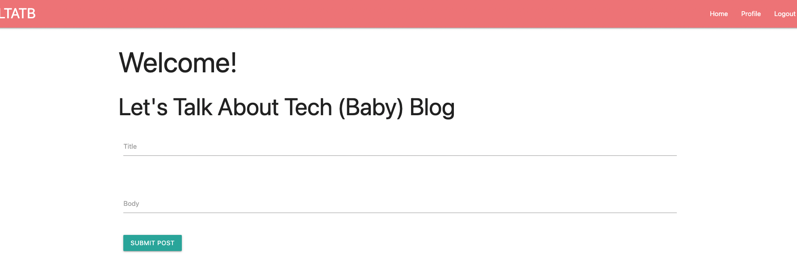
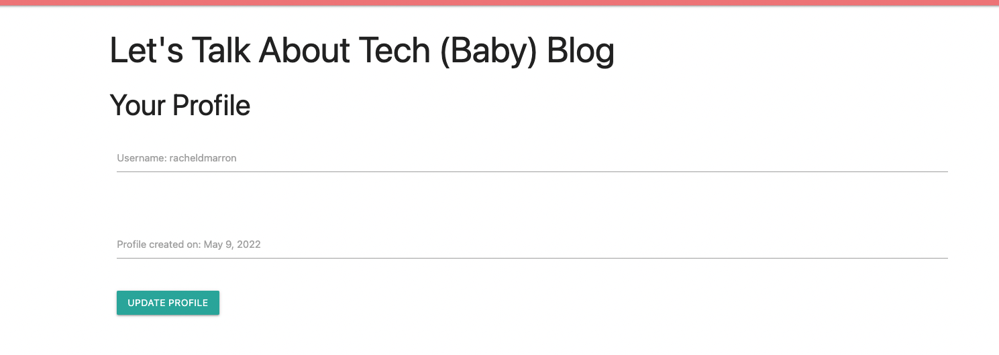
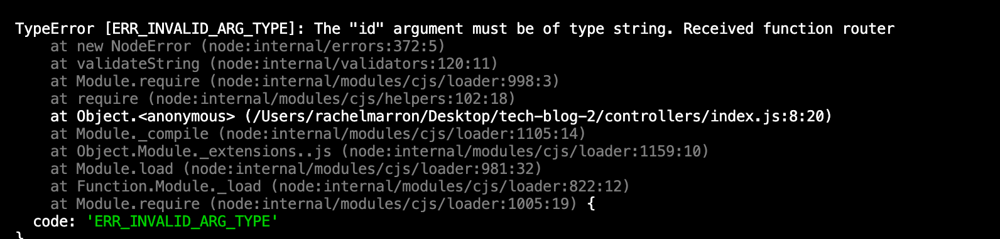

## MVC - Let's Talk About Tech (Blog)

## Link to Deployed Assets
https://git.heroku.com/dry-plains-53791.git


## NOTE TO GRADERS:
I have spent countless hours on this assignment. I have worked with multiple tutors and am getting an error when running node server.js that no one can explain.

I have honestly tried my very best and I have completed all of the code needed for this assignment, I am just having trouble running a successful build. I understand if you have to give me a bad grade, but please don't fail me or mark this as incomplete as I really have done all that I can and the physical code should speak to my ability to understand MVC. 

## Visual Representations
## Images 





## Overview 
A CMS style blog for engineers to write about tech and code. Following the MVC paradigm, this app is built with Handlebars, Express, and Materialize CSS. Users can create and authenticate their account, add and edit blogs, and comment on other users. 

## User Story
```md
AS A developer who writes about tech
I WANT a CMS-style blog site
SO THAT I can publish articles, blog posts, and my thoughts and opinions

```

## Acceptance Criteria
```md
GIVEN a CMS-style blog site
WHEN I visit the site for the first time
THEN I am presented with the homepage, which includes existing blog posts if any have been posted; navigation links for the homepage and the dashboard; and the option to log in
WHEN I click on the homepage option
THEN I am taken to the homepage
WHEN I click on any other links in the navigation
THEN I am prompted to either sign up or sign in
WHEN I choose to sign up
THEN I am prompted to create a username and password
WHEN I click on the sign-up button
THEN my user credentials are saved and I am logged into the site
WHEN I revisit the site at a later time and choose to sign in
THEN I am prompted to enter my username and password
WHEN I am signed in to the site
THEN I see navigation links for the homepage, the dashboard, and the option to log out
WHEN I click on the homepage option in the navigation
THEN I am taken to the homepage and presented with existing blog posts that include the post title and the date created
WHEN I click on an existing blog post
THEN I am presented with the post title, contents, post creator’s username, and date created for that post and have the option to leave a comment
WHEN I enter a comment and click on the submit button while signed in
THEN the comment is saved and the post is updated to display the comment, the comment creator’s username, and the date created
WHEN I click on the dashboard option in the navigation
THEN I am taken to the dashboard and presented with any blog posts I have already created and the option to add a new blog post
WHEN I click on the button to add a new blog post
THEN I am prompted to enter both a title and contents for my blog post
WHEN I click on the button to create a new blog post
THEN the title and contents of my post are saved and I am taken back to an updated dashboard with my new blog post
WHEN I click on one of my existing posts in the dashboard
THEN I am able to delete or update my post and taken back to an updated dashboard
WHEN I click on the logout option in the navigation
THEN I am signed out of the site
WHEN I am idle on the site for more than a set time
THEN I am able to view comments but I am prompted to log in again before I can add, update, or delete comments
```

## Installation
This application can be run using the deployed Heroku link. To run on your computer locally, follow these steps below:
<ul>
<li>Clone this repository to your computer</li>
<li>Run "npm install" in the command line of your terminal</li>
<li>Run "npm start" to start the application's backend</li>
</ul>

## Contributors
<ul><li>
Jordan Hessler - Outside Tutor</li>
<li>Mohammed Khalid - Outside Tutor</li>
<li><a href="https://zoom.us/rec/play/0PGOts2EI161kt6RGkoM6gbjRd4T9b34Vy5KzHfwr0S4DmEdA9bv_fVjYUQ8TeT0kRbvd4igB3dYyJNm.a3rCYKKEFjZ0tsio?startTime=1647505178000&_x_zm_rtaid=fu5DDgBeTYmDNaPVPMBe1A.1654362037808.76e42991f0ba327a782bec9142aa6c86&_x_zm_rhtaid=345">UCI Bootcamp Homework Walkthrough</a></li>
<li>UCI Professor</li> 
</ul>

## License

This application is covered under MIT License    

[](https://opensource.org/licenses/MIT)

- - -
© 2022 Rachel Delaney Marron, Inc. All Rights Reserved.